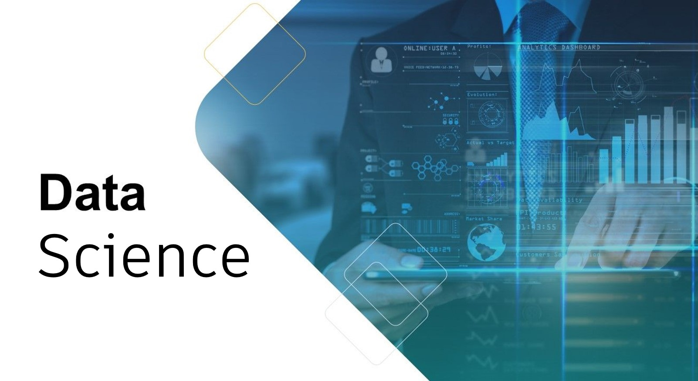

# My_projects

Данные проекты были выполнены в рамках курсов "Специалист по Data Science" и "Deep Learning".

| Название проекта | Описание | Используемые библиотеки | 
| :---------------------- | :---------------------- | :---------------------- |
| [Отток клиентов](telecom) | Прогноз оттока клиентов Оператора связи. | *python pandas seaborn matplotlib phik imblearn sklearn  lightgbm catboost* |
| [Классификация изображений](simpsons) | Классификация изображений с помощью сверточных сетей. | *python pytorch ResNet18* |
| [МО для текстов](comments_toxic) | Требуется разработать инструмент, который будет искать токсичные комментарии и отправлять их на модерацию. | *python pandas sklearn tf-idf nltk  lightgbm log_regression random_forest* |
| [Прогноз заказов такси](taxi-orders) | Прогноз количества заказов такси на следующий час. | *python pandas sklearn statsmodels lightgbm catboost linear_regression* |
| [Анализ тарифов](tariff_telecom) | Проверка гипотез (статистический тест) на выборке клиентов, какой тариф приносит больше дохода. | *python pandas scipy* |

