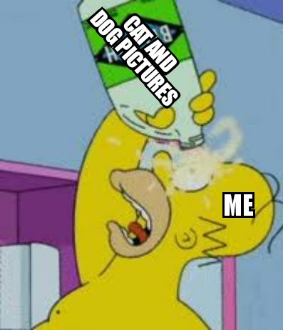

# Классификация изображений с помощью сверточных сетей.

В нашем распоряжении архив изображений героев сериала "Симпсоны". Необходимо классифицировать персонажей.

## Данные

Архив состоит из картинок размером 224х224:
- обучающая выборка - 20933 объекта
- тестовая выборка - 991 объект
- 42 (персонажа) класса представлено.

## Задача

Необходимо обучить сверточную нейронную сеть для классификации изображений.

## Вывод

Использован подход взвешенного самплера WeightedRandomSampler для борьбы с дисбалансом классов. В рамках исследования рассмотрены Простая сеть (5 слоев) и предобученная ResNet18. 

## Используемые библиотеки
*python pandas numpy sklearn pytorch ResNet18*
